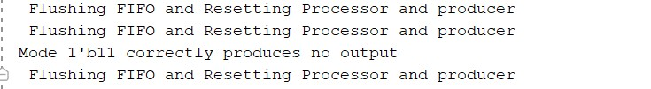
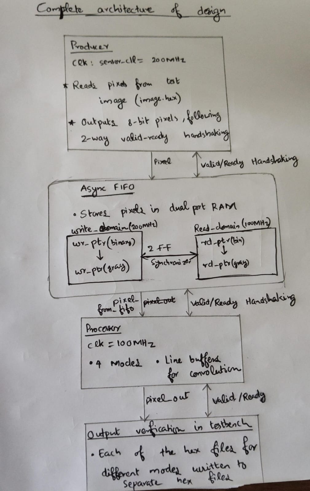
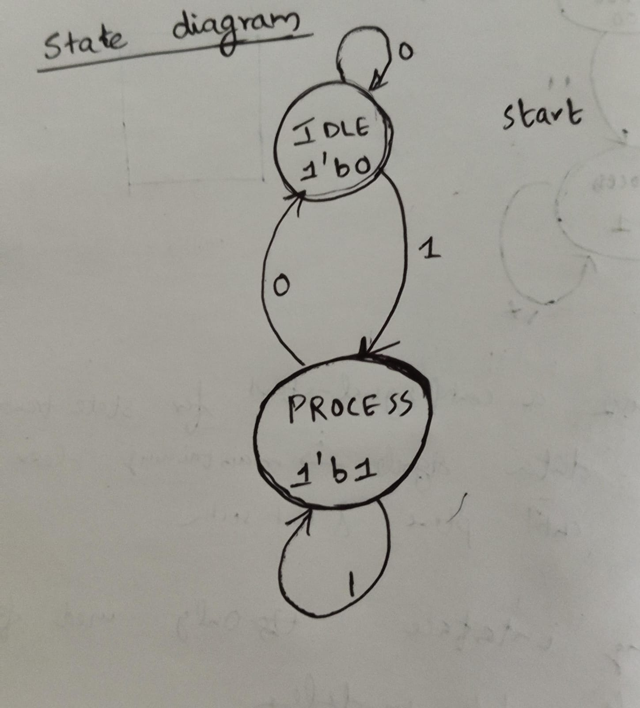
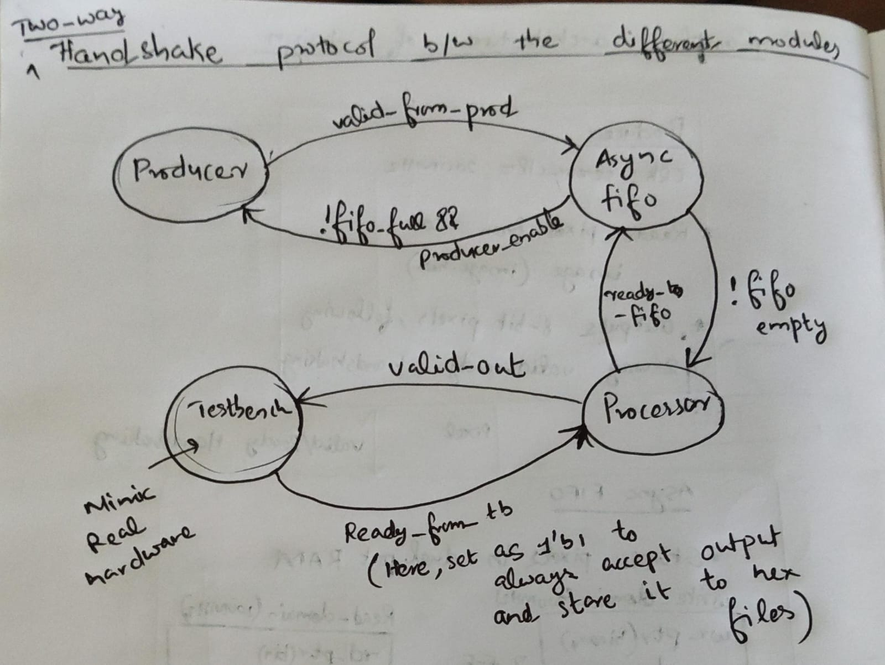
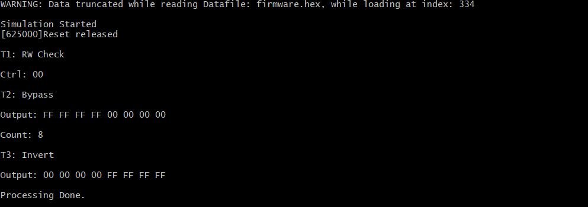
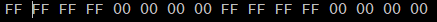
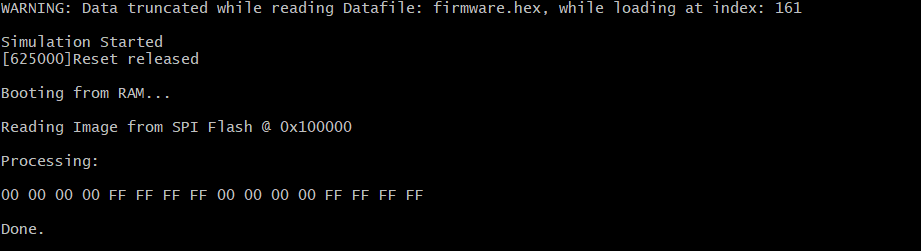

# IRIS Labs Hardware Recruitments - Assignment 1

## Part A : Testing CDC understanding
Questions:
1. Explain why synchronizing each bit of an encoded multi-bit control signal independently can lead to incorrect decoding in the receiving clock domain.

 The main problem with using individual synchronizers for multi-bit signal is the fact that the different flip flops that sample these bits may not do it at the exact same point .This can be due to slightly different electronic features internal to the different flip flops due to factors such as process variations across their die or due to possible external factors such as small data changing skews or slighly different propagation delay for the flip flops .Also, another issue is that the different synchronizers can have different metastability resolution times as well as possibly different rise and fall times. These differences can cause different bits to not reach the destination simultaneously and can get sampled at different at different clock edge in the destination clock edges. As a result, this can cause unwanted or wrong intermediate output signals to form at the destination.

2. Using the timing diagram, describe how skew between b[1] and b[0] causes adec[2:0] to momentarily take an invalid intermediate value.
 
 In the given timing diagram(in waveform.png file), it can be seen that b[0] transition at a slightly prior moment to b[1] and b[2]. Due to this reason, aq1[0] transitions to logic 1 ,one clock cycle(of Aclk) before aq1[1] and aq1[2] are asserted to logic 1 .Due to this, an unintended intermediate aq signal of 001 is asserted causing an invalid intermediate decode signal of aen[1] to be set for one cycle period before aq1 becomes 111 leading to the correct intended decode signal of aen[7] to be set.

3. Identify the fundamental CDC design mistake illustrated in this figure.

 The fundamental CDC mistake in the given design is not taking into the account the importance of synchronization of multi-bit signals in the receiving clock domain. The design overlooks the differences that can arise when multiple bits in a signal are passed to a different clock domain each with their own individual synchronizers. The slight differences that can arise in this setup(due to factors given in Q1) can cause data incoherency as illegal or unintended intermediate signals are formed at the destination. It is important that only one bit signals or properly encoded signals(such as gray code where multiple bits do not change in transition) are passed through synchronizers.

4. Propose three different design techniques that can be used to safely transfer this control information across clock domains without generating spurious decoded outputs.

 Three techniques that can be used to safely transfer this multi bit control information across clock domains without generating spurious decoded outputs are as follows:
### 1.Mux recirculation :  
A one bit control signal is synchronized to receiving clock domain using a valid single bit synchronization technique such as 2-flip flop synchronizer or toggle synchronizer. When the control signal is asserted the multi bit data signal is made stable and unchanging , the control signal is then synchronized to receiving clock domain after which point all the bits in the multi bit signal is sampled simultaneously .A mux is present in destination which selects the new data when the control bit is toggled ,else it keeps the previous data. The designer has to make sure that the multi bit data is not modified during the time period between the control bit being asserted and sent to the destination clock domain until the entire data is captured at receiving clock.Hence, this technique is useful when data is not changing frequently in source domain. 

### 2.Handshake protocol :
An improvement over the single bit control technique used in previous point is the use of valid/acknowledge handshaking signals which can  make the setup more robust. The source flip flop launches the valid control signal bit which is synchronized to receiving clock domain using a single bit synchronizer such as a 2-flip flop synchronizer .When valid is detected , the receiving clock starts the sampling the stable multi bit data. After the sampling ,the domain sends back acknowledge signal back to source .This process can be repeated to ensure safe exchange of data .

### 3.Asynchronous FIFO :
An asynchronous FIFO consists of a small shared memory where data from source is stored. It uses a read and write pointer to read from this memory by destination and write to this memory by source domain respectively.The pointers are incremented as to when data is read from or written to FIFO. The key idea is that the data doesn't cross the clock domains, only the pointers do. There is a mechanism to check whether the FIFO is full or empty. The destination should not read from the FIFO when it is empty and the source should not write to it when it is full. Another important consideration here is how the two pointers are implemented .Since they will be have to pass through the clock domain, using binary encoding for this can cause problems as multi bit binary transitions can cause more than one bit to change in transition ,hence , we are back to the problem of synchronizing multi bit values across the two clocks. The solution to this is to use gray code encoding for pointers .When a gray code value is incremented , only a single bit change happens in it. Hence, this becomes a single bit synchronization problem which can solved using any of our single bit synchronization techniques. 

## Part B : Designing data-processing block
### Design of processing block:
Initially , I have Implemented data processing logic in data_proc.v file before dealing with the clock domain synchronization of data producing and data processing blocks. The features of the block :
- Streaming valid/ready interface: A minimal two-way handshake protocol between the data-producing block and data-processing block as well as between the data processing block and any dependent block/consumer that may want to accept the processed data from this domain. It uses standard READY/VALID signals to establish data transfer.
- The data processing block supports all three required processing modes : bypass, invert and convolution. In bypass mode, the pixel inputs are sent to output as it is without any processing done on it while in invert mode, each of the pixel values are inverted . For convolution , i have taken a simple  3x3 box blur kernel(each of the 9 matrix elements are 1) which basically takes a pixel and it's neighbouring pixel values and takes their average ,giving blurry effect.
- Line buffer architecture is used to store pixels for convolution to increase memory usage efficiency .At a time, only threes of 32 pixels(96 bytes) are used ,only enough pixels to apply convolution for a single pixel .This improves memory usage as the entire 32x32 image don't have to be stored in memory all at once.
- Reset control signal along with proper reset behaviour for all the signals are implemented .

### CDC handling:
Since the producing and processing clocks are in different clock domains, synchronization is needed to resolve the pixel data loss from producer to processor . Asynchronous fifo with gray coded pointers are chosen for this purpose .The gray coded pointers are synchronized across the two domains using a 2 flip flop synchronizer .The FIFO acts as the interface between the producing block and processing block ,keeping track of pixels coming in from producer and storing them in buffer and later letting the processing block access it. This is important since the producer is running on a faster clock than processing module, and as such there would be data loss from producer to processor if there was not a FIFO buffer to store the pixels coming in at a faster rate and giving enough time to the processing module to access the pixel values in it's clock domain.

### Testbench validation: 
For validating the testbench , i've used a sample checkerboard 32x32 image(original_checkerboard.jpg) in it's hex format(image.hex). The testbench is updated with required signals and instantiations .All the 3 modes are tested and for the fourth mode value(1'b11) ,a display message is produced to show that no valid outputs are produced here. For the three valid modes, a separate hex value is given as output after the required operations are done on the pixels: output_bypass.hex,output_invert.hex and output_conv.hex. There was an issue with output files other than bypass.hex ,losing some of the initial pixel values in output hex files. To deal with that, a task flush_fifo_and_reset is designed to reset the fifo , producer and processor blocks in between going to next mode after testing precious mode. It is called between testing every mode in testbench .

 A python script(hex_to_image.py) is used to convert these output hex files and the original hex file back to jpg format so that final results can be validated .

<table style="width:100%">
  <tr>
    <td align="center" style="width:20%">
      
       
      <b>Original</b>
    </td>
    <td align="center" style="width:20%">
      
       
      <b>Bypass</b>
    </td>
    <td align="center" style="width:20%">
      
       
      <b>Inverted</b>
    </td>
    <td align="center" style="width:20%">
      
       
      <b>Convoluted</b>
    </td>
  </tr>
</table>

 Simulation result in console verifying the absence of valid output in mode 3.

### Design choices:

- For the streaming interface ,a way two handshake protocol is established between all the modules .This is much more robust than a one-way handshake interface which will not have READY signal from consumer and as such the lack of this backpressure , can cause data loss if producer sends data to the consumer module when the consumer is still processing previous data and is not ready to accept new data .A higher phase handshake like a 4-way one can be more robust but it comes at the cost of higher complexity and more latenccy. As such ,I chose a two way VALID/READY interface which is a good compromise between the two. 

- An asynchronous FIFO with gray coded pointers have been chosen to deal with CDC issue. Since the sender(data producing block) has a higher frequency than the processing block, a buffer is needed to store the pixels coming at a faster rate from producer .The FIFO helps to deal with this issue and prevent data loss .It is comparatively a better alternative than a handshake protocol which will have a higher latency and doesn't allow for continuous data flow like a FIFO.

- As mentioned above ,a line buffer has been implemented to deal with convolution that helps improves memory efficiency as only three rows of image have to be stored at a time rather than the entire image .This is especially important when it comes to FPGA implementations as they have limited BRAM and SDRAM .The use of external memory require complex interfaces and higher cost barriers.

### Diagrams:
- Architectural diagram

- State transition of processing block

- Ready/Valid Streaming interface

## Part C : Integrating with RISC-V SoC

- ### Register map defined to integrate data processing block to the soc:

<table>
  <thead>
    <tr>
      <th style="text-align:left">Address</th>
      <th style="text-align:left">Register Name</th>
      <th style="text-align:center">Access</th>
      <th style="text-align:left">Description</th>
      <th style="text-align:left">Bit Fields</th>
    </tr>
  </thead>
  <tbody>
    <tr>
      <td><code>0x02001000</code></td>
      <td><strong>DP_CONTROL</strong></td>
      <td style="text-align:center">R/W</td>
      <td>Control register to configure mode and start execution</td>
      <td>
        <strong>[2:1]</strong> Mode Select: 
        &nbsp;&nbsp;<code>00</code> = Bypass 
        &nbsp;&nbsp;<code>01</code> = Invert 
        &nbsp;&nbsp;<code>10</code> = Convolution 
        <strong>[0]</strong> Start (1 = Enable)
      </td>
    </tr>
    <tr>
      <td><code>0x02001004</code></td>
      <td><strong>DP_STATUS</strong></td>
      <td style="text-align:center">R/O</td>
      <td>Status flags to check hardware state</td>
      <td>
        <strong>[1]</strong> Output Valid (1 = Ready to read) 
        <strong>[0]</strong> Busy (1 = Processing)
      </td>
    </tr>
    <tr>
      <td><code>0x02001008</code></td>
      <td><strong>DP_PIXCOUNT</strong></td>
      <td style="text-align:center">R/O</td>
      <td>Track processed pixels</td>
      <td>
        <strong>[31:0]</strong> Total Pixel Count
      </td>
    </tr>
    <tr>
      <td><code>0x0200100C</code></td>
      <td><strong>DP_DATA</strong></td>
      <td style="text-align:center">R/W</td>
      <td>Data port for streaming pixels out</td>
      <td>
        <strong>[8]</strong> Read Valid Flag (Read-only) 
        <strong>[7:0]</strong> Pixel Data (Input/Output)
      </td>
    </tr>
  </tbody>
</table>

- ### Design :
  - Bus interface : data_proc_wrapper.v implements a minimal handshaking protocol linking the cpu core with the processing block. The CPU core only writes and read to and from the 32 bit registers defined above, similar to how it will do any other memory mapped peripheral.Hence,this wrapper logic is necessary to decode these address values of registers in a way that the hardware block can understand and act on it.

  - Firmware.c : Consists of a small test program which writes 0x03 to DP_CONTROL to trigger Invert Mode (Mode 01) and set the Start bit. 
  This is used to verify the proper working of this design .The program also makes use of the given UART module to print the processed pixels .
  
  Initially, the program directly used RAM without flash .The image.hex was directly compiled into firmware.hex which was loaded directly into RAM at boot and cpu would directly fetch it from there. This was done to help debug the program and the results are verified as given below :

  

  Now ,the image.hex makes use of spiflash and is loaded there initially .The risc-v core makes use of the spimemio controller to access this data and process the pixels. The program is verified as follows :

  Input sequence(at start of image.hex) :  
  

  As can be seen , the correct inverted sequence of first 16 input bytes is given as output .

  - Makefile : A minimal build system with the following commands is implemented :
    
    - make all : Executes the entire necessary pipeline, all the way from Compiling the C firmware and Verilog processing logic, and running the simulation.

    - make firmware : Uses the riscv64-unknown-elf-gcc toolchain to compile start.s and firmware.c into an .elf file. It then extracts the raw binary and uses makehex.py to format it into a firmware.hex file that the Verilog $readmemh system task can load into simulated RAM.

    - make clean : Deletes all automatically generated object files, binaries, hex files, and Xilinx simulation directories and files created by vivado during the compilation and simulation of the program, leaving only the source and testbench files that were present before.
